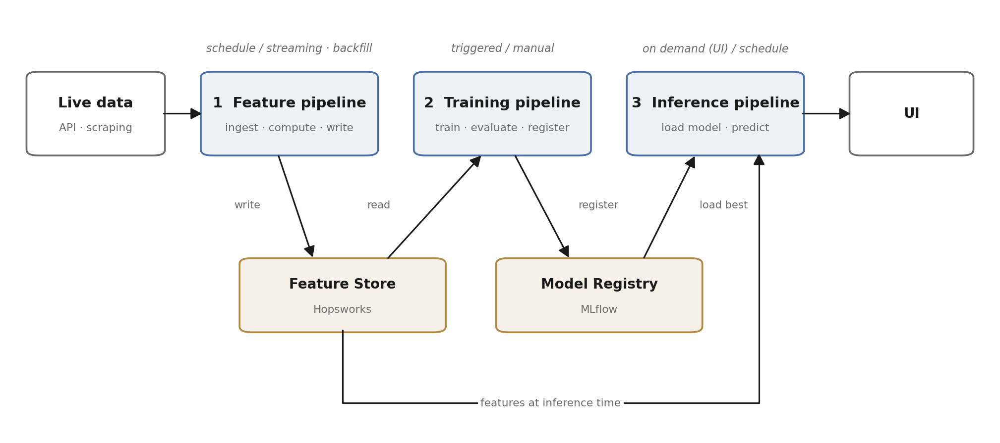

<!--
README requirements (Repository Guide, "By MS4"):
  prediction · FTI diagram · clone-and-run steps · live URL · video link
The video link goes AT THE TOP. Everything marked TODO must be gone by 2027-01-10.
-->

# TODO: project name

> **TODO: one sentence — what this predicts, how far ahead, and for whom.**
> e.g. "Predicts X for Y, 60 minutes ahead, updated hourly."

<!-- MS4: unlisted YouTube / SWITCHtube link goes here, at the top. No video files in the repo. -->
**Live system:** TODO · **Video (3 min):** TODO

---

## What this is

TODO: two or three sentences. What problem, what data, what the model does, and what a visitor
can try right now.

**Success criterion:** TODO — metric with a number, measured against TODO baseline.

## Architecture



Three decoupled pipelines. They never call each other; they communicate only through the
feature store and the model registry.

| | Pipeline | Trigger | Reads | Writes |
|---|---|---|---|---|
| 1 | **Feature** | hourly (GitHub Actions) + on-demand backfill | live source | feature store |
| 2 | **Training** | scheduled / manual | feature store | model registry |
| 3 | **Inference** | on demand (UI) / scheduled | registry + feature store | predictions / UI |

Regenerate the diagram after any stack change:

```bash
python scripts/make_architecture_diagram.py --out docs/src/architecture.png
```

## Stack

| Concern | Choice | Why |
|---|---|---|
| Feature store | Hopsworks | point-in-time-correct joins — training and serving read identical feature definitions |
| Tracking & registry | MLflow | experiment tracking plus aliased model versions |
| Orchestration | GitHub Actions | scheduled pipelines live next to the code |
| Serving | Google Cloud Run | container deploy, scales to zero |
| Storage | Google Cloud Storage | TODO |

## Clone and run

```bash
git clone https://github.com/kianakiser/TODO.git
cd TODO

# 1. dependencies (exact versions from uv.lock)
uv sync

# 2. secrets
cp .env.example .env
#    then fill in .env — see the table below

# 3. run the pipelines
uv run python -m mlops_project.features.run          # ingest + write features
uv run python -m mlops_project.training.run          # train, evaluate, register
uv run python -m mlops_project.inference.serve       # serve predictions

# backfill a date range through the SAME feature pipeline
uv run python -m mlops_project.features.backfill --start 2026-10-01 --end 2026-10-31
```

Or with Docker:

```bash
docker build -t mlops-project .
docker run --rm --env-file .env -p 8080:8080 mlops-project
```

### Environment variables

Names only — see [`.env.example`](.env.example). Never commit `.env`.

| Variable | What it is | Where to get it |
|---|---|---|
| `SOURCE_API_KEY` | TODO | TODO |
| `HOPSWORKS_API_KEY` | feature store access | Hopsworks → Account Settings → API keys |
| `HOPSWORKS_PROJECT` | Hopsworks project name | Hopsworks project overview |
| `MLFLOW_TRACKING_URI` | tracking server | local: `http://localhost:5001` |
| `GCP_PROJECT_ID` / `GCS_BUCKET` | serving + storage | Google Cloud console |

The same names must exist as **GitHub Actions secrets** for the scheduled pipelines to run.

## Tests

```bash
uv run pytest            # includes repo-hygiene checks that enforce the course rules
uv run ruff check .
```

## Repository layout

```
├── src/mlops_project/
│   ├── features/     feature pipeline (ingest, backfill, compute, write)
│   ├── training/     training pipeline (read features, train, evaluate, register)
│   ├── inference/    inference pipeline (load model, predict, serve)
│   └── common/       shared config, IO, and the single source of feature definitions
├── ui/               front end
├── config/           settings without secrets
├── tests/            unit tests, run in CI
├── notebooks/        exploration only — pipelines never import from here
├── docs/             proposal.pdf, ms*_summary.pdf, architecture diagram
└── .github/workflows/  CI + scheduled pipelines
```

Feature definitions live in exactly one place under `common/` and are used by both training and
inference. That is what keeps training–serving skew out.

## Milestones

| | Due | Status |
|---|---|---|
| MS1 Proposal | 2026-10-01 | ☐ |
| MS2 Feature pipeline | 2026-11-05 | ☐ |
| MS3 Training pipeline | 2026-12-03 | ☐ |
| MS4 Live system | 2027-01-10 | ☐ |

---

Semester project for **I.BA_MLOPS** (MLOps), BSc Artificial Intelligence & Machine Learning,
Hochschule Luzern — HS26.
